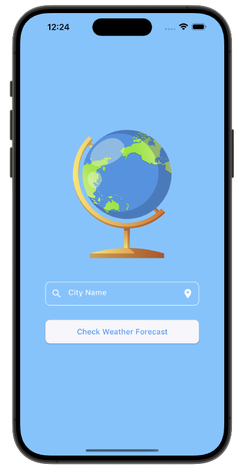
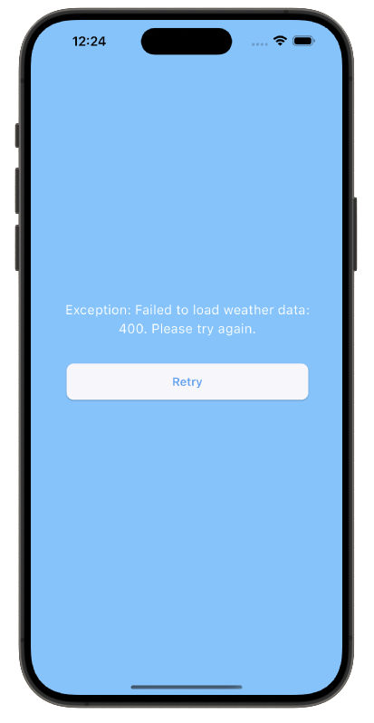
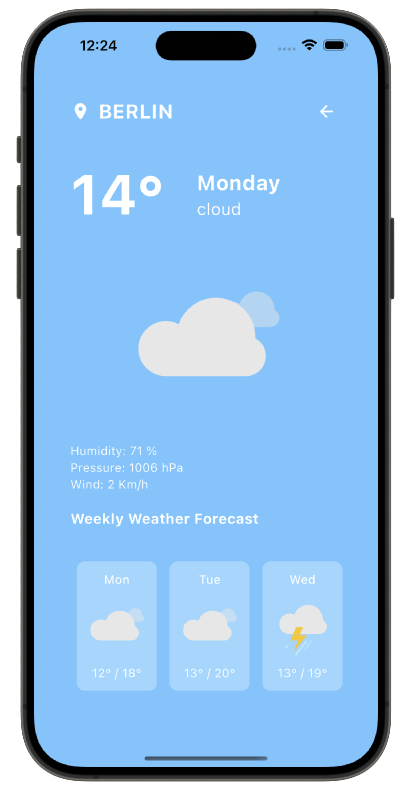

# Weather Forecast App using BLoC

## Overview
The Weather Forecast App is a modern, responsive Flutter application that provides real-time weather information for any city. Built using the BLoC pattern for effective state management, the app ensures a clean separation of business logic from the UI, leading to a robust and maintainable codebase.

This project utilizes the [OpenWeatherMap API](https://openweathermap.org/api) to retrieve up-to-date weather data, giving users a detailed view of the current and upcoming weather conditions.

## Screenshots

  

 

## Features
* **Loading Indicator**: Displays a loading animation while fetching weather data.
* **Weather List**: Shows a list of daily weather summaries, each containing the day of the week, weather condition icon, and a brief description.
* **Weather Details**: Provides detailed weather information such as day of the week, condition name and icon, current temperature, humidity, pressure, and wind speed.
* **Dynamic Updates**: Selecting a weather list item updates the detailed view for the chosen day.
* **Pull-to-Refresh**: Refreshes the weather data using a pull-down gesture.
* **Error Handling**: Displays an error screen with a retry button if data fetching fails.
* **Responsive Design**: Supports both horizontal and vertical layouts for an optimized user experience across different screen sizes.

## Content Attribution
The Lottie files used to display weather icons and animations within the app were downloaded from https://lottiefiles.com/

## Technologies Used
* **Flutter**: Framework for building high-quality, natively compiled applications for mobile, web, and desktop from a single codebase.
* **Dart**: Programming language used to write Flutter applications.
* **BLoC (Business Logic Component)**: State management pattern for separating business logic from UI components.
* **HTTP Package**: Facilitates HTTP requests to interact with the OpenWeatherMap API.
* **Geolocator & Geocoding**: Provides geolocation capabilities to fetch weather data for the user's current location.
* **Equatable**: Simplifies equality comparisons in Dart objects, making BLoC events and states more efficient.
* **Permission Handler**: Manages runtime permissions for accessing location data.
* **Lottie**: Adds smooth animations for loading indicators and error messages.
* **Linting**: The project adheres to best coding practices using custom lint rules to maintain a clean codebase.
* **Widget Testing**: Comprehensive widget tests ensure the stability and reliability of UI components.

## Responsiveness

The application is designed to provide a consistent and enjoyable experience across various screen sizes, from small mobile devices to large tablets. Whether in portrait or landscape mode, the app adapts seamlessly to offer an intuitive and engaging user interface.

## API Connection
The Weather Forecast App seamlessly connects to the OpenWeatherMap API to fetch real-time weather data, ensuring that users always have the latest weather information. The integration includes fetching the current weather, five-day forecast, and other relevant details for the selected location.